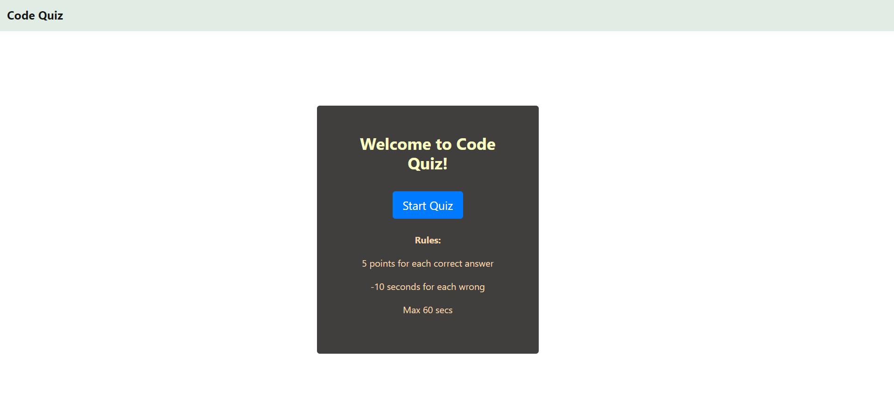
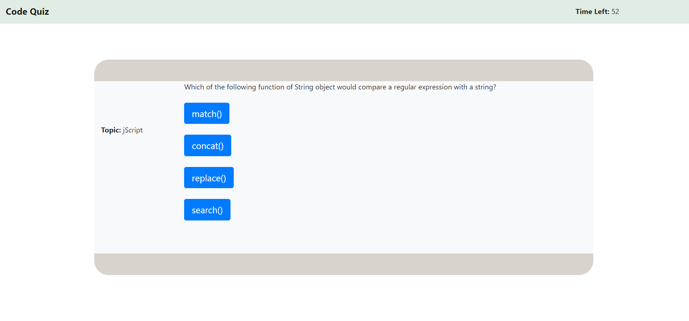
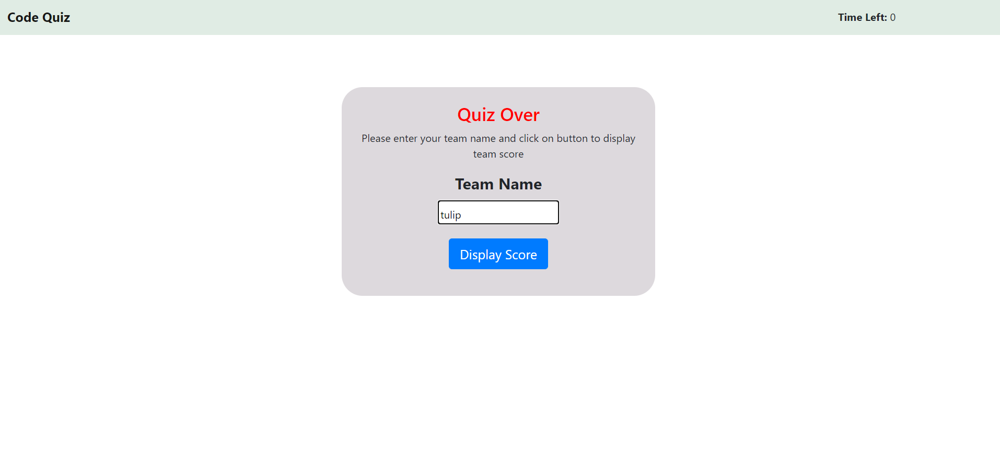
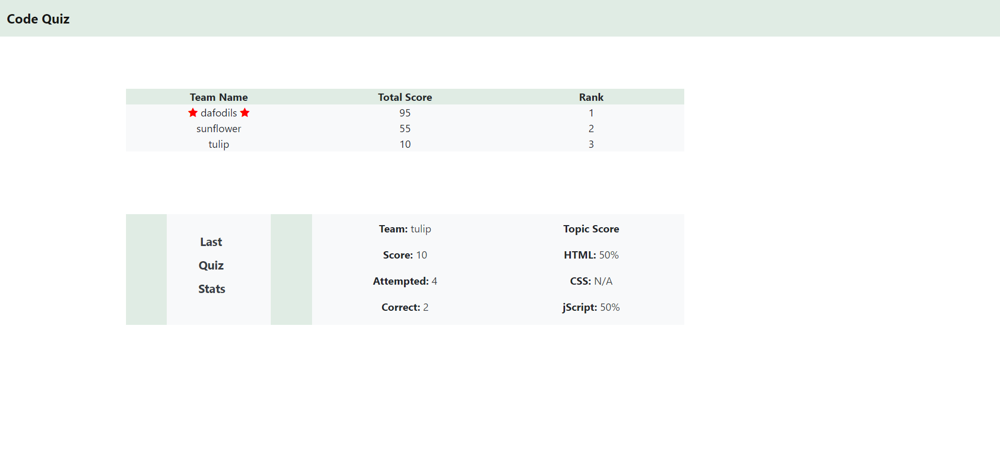

# Code Quiz

##   

## Description
This is a typical coding assessment having a combination of multiple-choice questions and interactive coding challenges. This app will run in the browser, and will feature dynamically updated HTML and CSS powered by JavaScript code,  it has a clean, polished, and responsive user interface. 

## Task
To create a timed quiz on JavaScript fundamentals that stores high scores.

## Link
- [Welcome Page](https://dassoumik.github.io/code-quiz/)

## Screenshots
- 
- 
- 
- 

## Learnings
- Learned about the local storage and how to use it to store and manipulate historical client browser activity data. 
- Got accustomed with the different Web APIs which can reduce development time for applications.
- Learning about how to identify the target element of an event was also very useful. 

## Technology Used
- HTML
- CSS
- Javascript

## License  
This app follow **MIT** licensing rules. Please check below link for more details.
    
https://choosealicense.com/licenses/mit/  
   

## Questions  
  Please connnect with me at:   contact.soumikdas@gmail.com    
  Please also follow my github at the below link:  
      [Soumik Das](https://github.com/dassoumik)  

